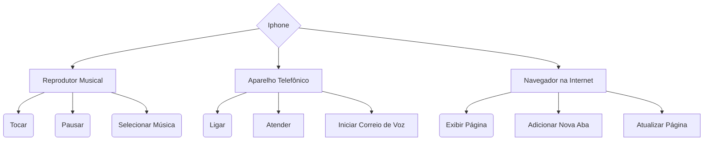

Diagrama iphone


```
flowchart TD
    A{Iphone}
    A --> B[Reprodutor Musical]
    A --> F[Aparelho Telefônico]
    A --> J[Navegador na Internet]
    B[Reprodutor Musical] --> C(Tocar) 
    B --> D(Pausar)
    B --> E(Selecionar Música)
    F[Aparelho Telefônico] --> G(Ligar) 
    F --> H[Atender]
    F --> I[Iniciar Correio de Voz]
    J[Navegador na Internet] --> K(Exibir Página) 
    J --> L[Adicionar Nova Aba]
    J --> M[Atualizar Página]
```
